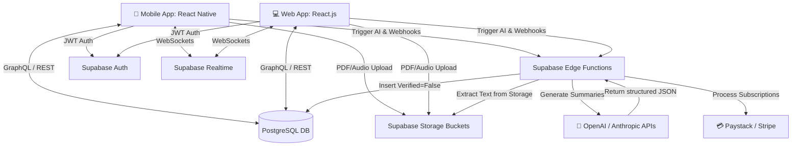
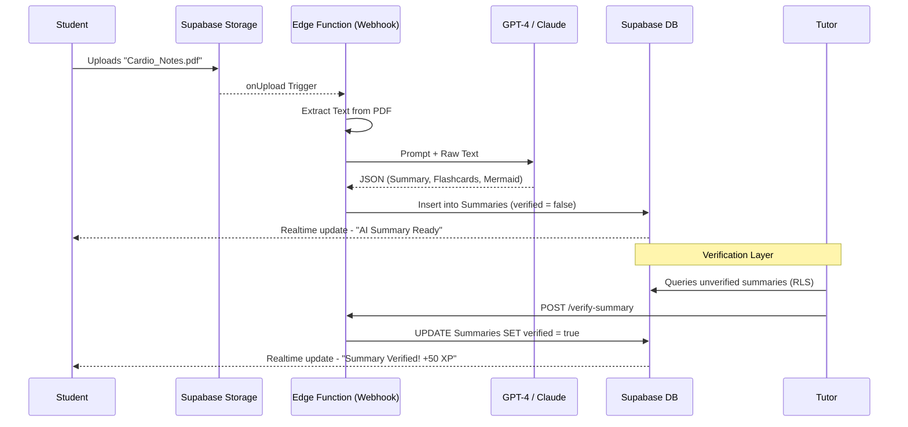

# System Architecture

Medico Hub is built upon a highly scalable, serverless architecture centered around Supabase.

## High-Level Data Flow

## AI Pipeline Detail

## Security & Concurrency
- **Concurrency**: High write-throughput (e.g. flashcard swipes) relies directly on Supabase PostgreSQL.
- **Security**: Strict Row-Level Security (RLS) prevents unauthorized reading of private notes. The `is_tutor_or_admin` function safeguards AI verification pipelines.
